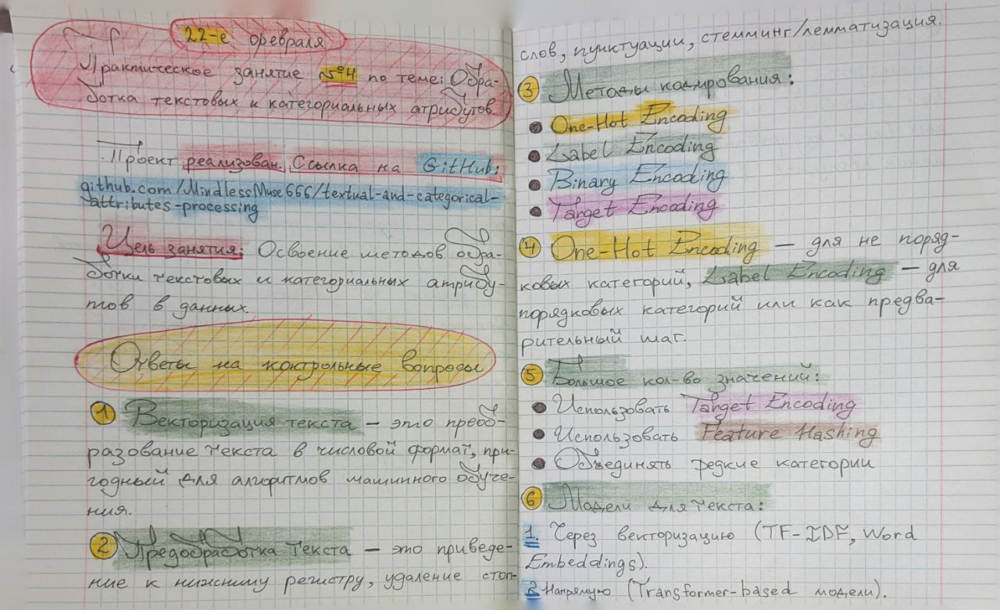
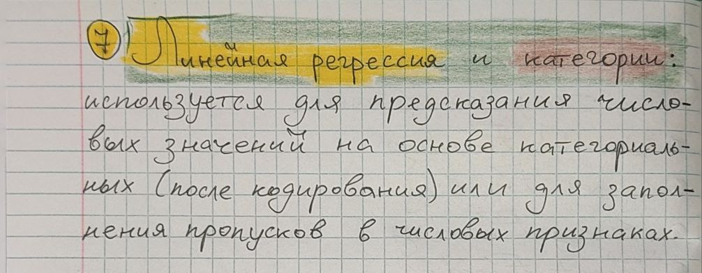

# Обработка текстовых и категориальных атрибутов 

**Проект по дисциплине:** МДК 13.01 Основы применения методов искусственного интеллекта в программировании

**Практическое занятие №4:** Обработка текстовых и категориальных атрибутов

## 1. Введение
В рамках данного практического занятия была выполнена обработка текстовых и категориальных атрибутов для данных о пассажирах Титаника и визуализация этого с использованием библиотек Seaborn и Plotly. 

Целью работы являлось освоение методов обработки текстовых и категориальных атрибутов в данных.

## 2. Скриншоты выполненного задания и конспекта лекции
### 2.1. Выполненное задание
#### 2.1.1. Скрипт [main.py](src/main.py)

  

#### 2.1.2. Скрипт [data_loader.py](src/data_loader.py)

  

#### 2.1.3. Скрипт [feature_engineering.py](src/feature_engineering.py)

  

#### 2.1.4. Скрипт [model_training.py](src/model_training.py)

  

### 2.2. Конспект лекции

  
  

## 3. Методика и подходы
### 3.1. Методы
В ходе работы применялись следующие методы:

* **Feature Engineering:** извлечение и преобразование признаков для улучшения качества данных.
* **Обработка пропущенных значений:** заполнение пропущенных значений в столбце 'Age' с использованием модели машинного обучения.
* **Обучение модели и оценка результатов:** определение признаков и целевой переменной для модели.
* **Визуализация данных:**
    * **Гистограмма:** для анализа распределения возрастов пассажиров с помощью *Seaborn*.
    * **Интерактивная диаграмма рассеяния:** для интерактивного исследования данных с помощью *Plotly*.
* **Сохранение графиков:**
    * **Сохранение** гистограммы *Seaborn* в формате *PNG*.
    * **Сохранение** интерактивной диаграммы рассеяния *Plotly* в формате *HTML*.
* **RMSE:** Подсчёт *Root Mean Squared Error* (метрики, которой измеряет точность предсказаний модели, особенно когда прогнозы представляют собой непрерывные числовые значения) до и после *Feature Engineering'а*.

### 3.2. Алгоритмы
Для построения графиков и обработки данных использовались следующие алгоритмы:

* *TF-IDF* для векторизации текстовых данных.
* *One-Hot Encoding* для категориальных признаков.
* *Label Encoding* для категориальных признаков.
* *Линейная регрессия* для заполнения пропущенных значений 'Age'.
* Подсчет *RMSE* до и после *Feature Engineering'а*.

### 3.3. Подходы
* **Объектно-ориентированное программирование (ООП):** Использована объектно-ориентированная парадигма для организации кода, разделение ответственности между классами `DataLoader`, `FeatureEngineering` и `ModelTraining`.
* **Принципы SOLID, KISS и DRY:** Применен подход, обеспечивающий гибкость, простоту и отсутствие дублирования кода.

### 3.4. Допущения и ограничения
* Предполагается, что данные, загруженные из CSV-файла, корректны и не содержат ошибок.
* Использована линейная регрессия для заполнения возраста, что может не учитывать сложные зависимости.
* Предварительная обработка данных включает в себя заполнение пропусков возраста и удаление строк с другими отсутствующими значениями.

### 3.5. Инструменты, библиотеки и технологии
* **Python:** основной язык программирования.
* **Pandas:** для загрузки и обработки данных.
* **Scikit-learn:** для машинного обучения (линейная регрессия, TF-IDF, One-Hot Encoding, Label Encoding).
* **Matplotlib:** для создания статических графиков.
* **Seaborn:** для улучшения визуализации графиков.
* **Plotly:** для создания интерактивных графиков.
* **Requests:** для загрузки данных из URL.

## 4. Результаты
### 4.1. Краткое описание данных
Данные были взяты из репозитория *Data Science Dojo* по ссылке: *https://github.com/datasciencedojo/datasets/blob/master/titanic.csv*. Формат данных - *CSV*. Набор данных содержит информацию о пассажирах Титаника, включая их *возраст*, *пол*, *класс билета*, *стоимость*, *выживаемость* и другие параметры.

### 4.2. Предварительная обработка данных
* Извлечены фамилия и имя из столбца *Name*.
* Категориальные признаки преобразованы в числовые (*Embarked*, *Sex*).
* Применен *One-Hot Encoding* к признаку *Pclass*.
* Создан признак *Description* путем объединения информации из нескольких столбцов.
* Применен *TF-IDF* для векторизации *Description*.
* Создан бинарный признак *HasCabin* на основе информации о каюте.
* Заполнены пропущенные значения в столбце *Age* с использованием модели *линейной регрессии*.

### 4.3. Графики и диаграммы
#### 4.3.1. Распределение возрастов (Seaborn)
Гистограмма показывает распределение возрастов пассажиров.

  

#### 4.3.2. Зависимость стоимости билета от возраста и класса (Plotly)
Зависимость стоимости билета от возраста и класса - интерактивная диаграмма рассеяния, где цвет и положение точек отображают класс и другие параметры пассажиров.

  

## 5. Анализ результатов
### 5.1. Подсчет *RMSE* до и после *Feature Engineering'а*

* ***RMSE* до *feature engineering'а***: 37.301439983527544
* ***RMSE* после *feature engineering'а***: 31.481127869827287

  

### 5.2. Выводы
* **Feature Engineering** и **обработка пропущенных значений** являются важными этапами для подготовки данных к анализу.
* **Визуализации** позволяют наглядно представить данные и выявить закономерности.
* **Интерактивные диаграммы *Plotly*** предоставляют возможность более глубокого исследования данных.

### 5.3. Обсуждение возможных улучшений
* Использовать более сложные модели для заполнения пропущенных значений *'Age'*.
* Добавить больше интерактивных элементов в графики *Plotly*.
* Применить другие методы *Feature Engineering* для создания новых признаков.
* Провести более детальный анализ влияния различных факторов на выживаемость.

## 6. Заключение
В ходе данного проекта были применены навыки *Feature Engineering*, обработки пропущенных значений и визуализации данных с использованием библиотек *Python*. Это позволило эффективно проанализировать данные о пассажирах Титаника и получить полезные выводы.

## 7. Лицензия
Этот проект распространяется под лицензией MIT - смотрите файл [LICENSE](LICENSE) для деталей.

## 8. Автор
Бедин Владислав ([MindlessMuse666](https://github.com/MindlessMuse666))

* GitHub: [MindlessMuse666](https://github.com/MindlessMuse666 "Владислав: https://github.com/MindlessMuse666")
* Telegram: [@mindless_muse](t.me/mindless_muse)
* Gmail: [mindlessmuse.666@gmail.com](mindlessmuse.666@gmail.com)
